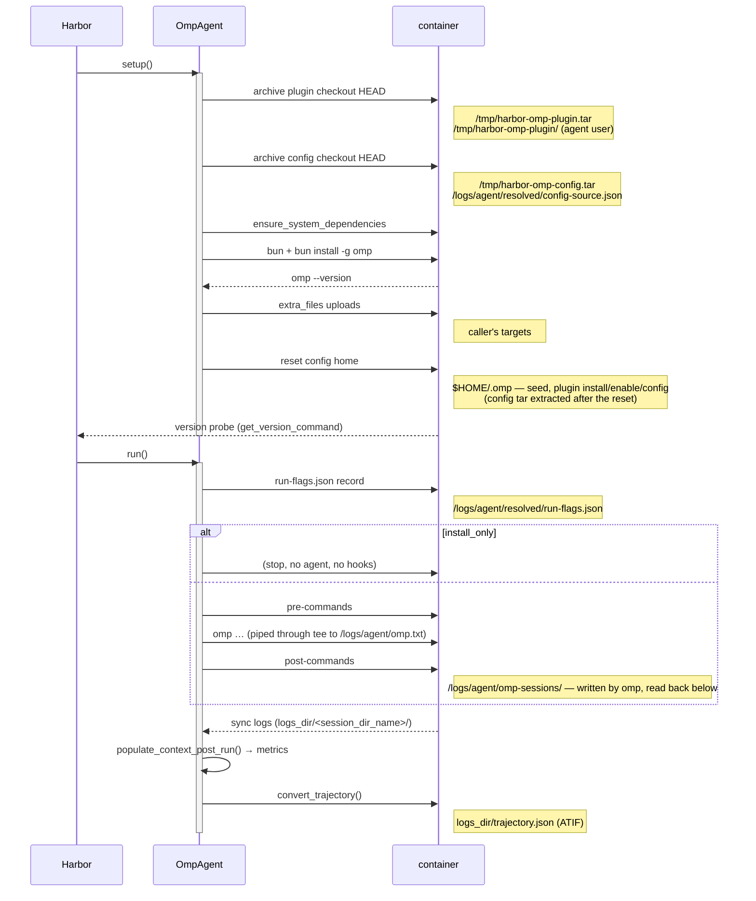

# Architecture

## Modules

| Module | Responsibility | Depends on |
|---|---|---|
| `harbor_omp/omp_agent.py` | The Harbor agent: `OmpAgent`, shipping, config-home steps, the run script, post-run metrics. | Harbor, pydantic, the rest of the package |
| `harbor_omp/options.py` | The option model and the npm-spec normalisation. | pydantic, Harbor's options base |
| `harbor_omp/install.py` | bun and omp installation, the version probe, container paths. | stdlib |
| `harbor_omp/session.py` | The session JSONL reader: usage, cost, steps. | **stdlib only** |
| `harbor_omp/trajectory.py` | The ATIF trajectory: the converter both paths use, and the validated write. | Harbor, pydantic, `harbor_omp.session` |
| `harbor_omp/hooks.py` | The documented extension points and the shell lines they compile to. | stdlib |

Two boundaries are deliberate:

- `session.py` has no third-party import, so a harness that runs omp without
  Harbor can still read a session (enforced by a test). Its one consumer inside
  the package is `trajectory.py`, which is where the Harbor dependency lives:
  the trajectory *is* a Harbor artifact, so it cannot travel with the reader.
- Nothing in the package imports a benchmark, a profile, or an eval harness. The
  only names it knows from the outside world are the options a caller passes
  (enforced by a test and a source scan).

## Lifecycle



A streaming job adds one loop: while the agent runs, Harbor's `sync_trajectory`
tars the session dir every ~2 s into a temporary logs dir and calls
`convert_trajectory` — the same converter, reading the same reader, from the
`<logs_dir>/sessions` layout — so the trial's `agent/trajectory.json` is
populated before the run ends. The post-run call above then rewrites it complete
from the session on disk.

What that loop does not give you: the metrics still arrive only after the run
(`AgentContext` is filled once, when the agent has exited), the live file is
written by Harbor's own writer and so is not put through the validator, and a
poll whose session is mid-write is refused by the accounting — the file updates
on the next poll rather than ever holding a partial session.

The run script is one shell, in this order:

```bash
set -uo pipefail
{ bun…; } || true                      # the agent may need bun's global bin on PATH
mkdir -p <logs>/<session_dir_name> || true
ORIG_HOME="$HOME"; export PATH="$ORIG_HOME/.bun/bin:$PATH"
export HOME=<config_home> PI_CONFIG_DIR=.omp
cd /app 2>/dev/null || true            # hooks and the agent share one cwd
<pre-commands>                         # exports reach the agent; a failure aborts here
rc=0
<omp argv …> 2>&1 </dev/null | tee <logs>/omp.txt
rc=${PIPESTATUS[0]}
harbor_omp_agent_rc=$rc                # saved before the post-commands can touch anything
(                                      # the post block is one subshell: `exit`,
  <post-commands>                      # an EXIT trap or `set -e` inside it ends the
)                                      # subshell and nothing else
harbor_omp_hook_rc=$?                  # the block's own status, reported by the parent
if [ "$harbor_omp_hook_rc" -ne 0 ]; then
  echo "harbor-omp: post-command failed (rc=…); the agent exit code is unchanged" >&2
fi
exit $harbor_omp_agent_rc
```

Why `set -uo pipefail` and not `-e`: the agent's status is captured from the
pipeline and reported as the exec's status, so Harbor's error classifier sees
omp's own failure instead of the last command in a chain — and the same reason
puts the post block in a subshell, so a post-command cannot end the script
before its status is recorded or replace it at exit.

## The seam

Everything a consumer adds arrives as option data:

- **files** — `extra_files`, uploaded during install as the agent user;
- **commands** — `pre_commands` (a gate: non-zero aborts before the agent, and
  an `export` here reaches the agent process) and `post_commands` (collection:
  one contained subshell, best-effort by construction);
- **config** — `seed` (config-dir-relative content) and `config_source` +
  `config_paths` (a host checkout shipped by committed HEAD).

The alternative — importing the consumer's modules — is what this package was
extracted to avoid: it makes neither side reusable and neither side testable.

## The ATIF trajectory

`OmpAgent.convert_trajectory(logs_dir)` is the one converter, and it serves both
producers: Harbor's live stream (which assembles a temporary logs dir whose
session tar is extracted under `<logs_dir>/sessions`) and
`populate_context_post_run` (which calls it with the agent's own logs dir and
writes `<logs>/trajectory.json`). `capabilities.atif` is true because both
happen, not because the flag was set.

The encoding, from `harbor_omp/trajectory.py`'s module docstring:

1. **One step per non-blank session line**, in file order. `message` events are
   conversation steps (`user` → `user`, `assistant` → `agent`); every other
   event — `session`, `title`, `model_change`, `thinking_level_change`,
   `custom`, `custom_message`, `title_change`, `model_usage` — is a `system`
   step.
2. **Every step carries its line**, decoded, under `extra.omp_event`. The
   trajectory alone reconstructs the session; the renderings in `message` are
   readings of that payload, and they say so.
3. **The accounting is checked.** `_account` refuses a trajectory whose steps do
   not account for every line — a torn line raises
   `TrajectoryAccountingError` rather than producing a shorter artifact that
   would read as a complete one. The post-run caller catches it, logs it, and
   leaves the trial's metrics alone: they were read from the session first.
4. **The write is validated.** `write_trajectory` puts the document through
   `harbor.utils.trajectory_validator` on disk (a temporary file in the target
   directory) and only then replaces the target, so a document a consumer's
   loader would reject never lands.

Two choices are deliberate and cost something, so they are stated rather than
implied:

- **A `toolResult` line is its own `system` step**, not the calling step's
  `observation`. ATIF's `source` is one of `system`/`user`/`agent`, and Harbor's
  validator requires an observation result's `source_call_id` to name a tool
  call of *its own* step — folding the result into the calling step would leave
  its line with no step and break (3). The pairing is kept in
  `extra.omp_tool_call_id`, which matches the `tool_calls[].tool_call_id` on the
  agent step that issued the call.
- **`final_metrics` are the session reader's totals**, not a second summation
  over the steps, so the trajectory and `AgentContext` cannot disagree. The
  auxiliary model's `model_usage` records are real spend that ATIF cannot carry
  as step metrics (a `system` step may not have `metrics`), so their per-model
  numbers live in `final_metrics.extra.models`, built by the one
  `trajectory.model_usage` mapping the context also uses.

The reader stayed the single parser: `session.read_session_lines` is the
accounting view (every non-blank line, decoded or not) beside the existing
streaming `iter_session_events`, and both share `_parse_event`; the numeric
coercion and the "zero cost means not reported" rule are shared too, so a value
the metric path counts as unreadable cannot be read as a number elsewhere.
