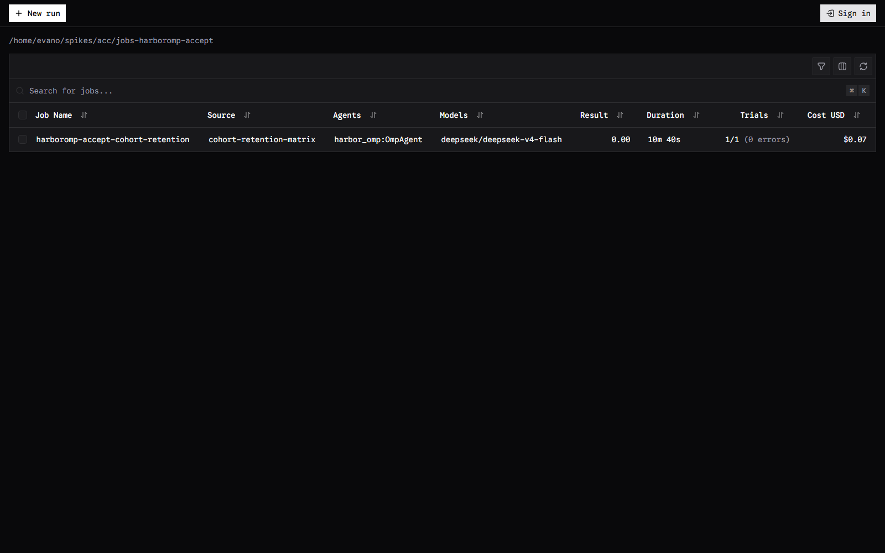

# Worked example — a real benchmark, over Daytona

This is a reproducible record of two runs, not a tutorial sketch:

1. **A single-task acceptance trial** that proves `harbor_omp:OmpAgent` drives a
   real Harbor trial end to end — install, sandbox, agent, verifier, ATIF
   trajectory, cost.
2. **The full 30-task data-eng-bench** run on **four parallel Daytona
   sandboxes**, which is where the practical parallelism ceiling and two
   foot-guns showed up.

Everything below was observed on 2026-10-09. Commands are given as run.

## 1. Prerequisites

Harbor's interpreter must be able to import this package. Install Harbor *with
the Daytona extra* and this package injected:

```bash
uv tool install 'harbor[daytona]==0.24.0' \
  --with /path/to/harbor-omp
```

> **Foot-gun #1 — the extra is silently dropped.** `uv tool install
> harbor==0.24.0 --with harbor-omp` (no quotes, no `[daytona]`) installs a
> Harbor that *cannot* build a Daytona environment. It fails at
> `harbor/environments/daytona/environment.py` with
> `MissingExtraError: The 'daytona' package is required but not installed.`,
> raised during environment construction — **before** any sandbox is created.
> The quotes matter: the shell expands `[daytona]` as a glob otherwise.

Credentials come from the environment (`DAYTONA_API_KEY`, `OPENROUTER_API_KEY`).

## 2. The acceptance trial

One task, one sandbox, the whole path exercised:

| Field | Value |
|---|---|
| Task | `cohort-retention-matrix` |
| Agent | `harbor_omp:OmpAgent` |
| Model | `openrouter/deepseek/deepseek-v4-flash` |
| Result | `0.0` (fail — matches the incumbent adapter's row for this task) |
| Duration | 10 m 40 s |
| Trials | 1/1, **0 errors** |
| Cost | **$0.074** |
| Sandbox | Daytona, **2 GiB** (requested `override_memory_mb: 3000`; Daytona floors to GiB) |
| `agent/trajectory.json` | 962,818 bytes, ATIF v1.8, **`validate_trajectory` → True**, 106 steps |
| Verifier | 23/24 pytest passed |
| Tokens | 1,718,691 in / 37,166 out / 1,651,712 cached |

A `fail` verdict is the *right* result here — it matches the incumbent's row for
the same task. The acceptance claim is that the **machinery** works: the
trajectory validates against Harbor's own validator, the cost is
provider-reported, and the verifier ran.

### The trial, viewed

`harbor view <jobs-dir>` serves a local web UI over the trial artifacts:

```bash
harbor view /path/to/jobs-harboromp-accept
# → Starting Harbor Viewer
#   Server: http://0.0.0.0:8080
```



The page reads back exactly the row above: job `harboromp-accept-cohort-retention`,
source `cohort-retention-matrix`, agent `harbor_omp:OmpAgent`, model
`deepseek/deepseek-v4-flash`, result `0.00`, `10m 40s`, `1/1 (0 errors)`, `$0.07`.

## 3. Running the benchmark on four parallel sandboxes

The target: the 30-task data-eng-bench ("fast-30"), four Daytona sandboxes in
flight at once. The whole run is one JSON job config (`harbor run -c`):

```jsonc
{
  "job_name": "harboromp-fast30-4x2g",
  "jobs_dir": "/path/to/jobs-harboromp-fast30",
  "n_attempts": 1,

  // Concurrency is a TOP-LEVEL field. The `orchestrator:` block is deprecated
  // (harbor/models/job/config.py: "Use top-level 'n_concurrent_trials'...").
  "n_concurrent_trials": 4,

  // The memory override: replaces each task's declared memory_mb.
  "environment": { "type": "daytona", "override_memory_mb": 2048 },

  "agents": [{
    "name": "harbor_omp:OmpAgent",
    "model_name": "openrouter/deepseek/deepseek-v4-flash",
    "kwargs": {
      "seed": { /* baseline profile content */ },
      "run_flags": ["--no-extensions", "--no-skills", "--no-rules"],
      "thinking": "high"
    }
  }],
  "tasks": [ { "path": "/path/to/tasks-fast30/<task>" }, /* … ×30 */ ]
}
```

### The memory recipe

Every fast-30 task declares `memory_mb = 8000` — a blanket vendor declaration
imported from the upstream benchmark, identical across all 30 tasks, not a
measurement. The image's DuckDB is **469 MB**, so 8000 is wildly oversized for
the sandbox and it makes parallelism impossible against a 10 GiB org cap.

Two facts govern what to ask for:

- **Daytona floors memory to whole GiB.** 8000 → 7 GiB, 3000 → 2 GiB, 2048 →
  2 GiB. **Request multiples of 1024**, or you pay for a GiB you did not ask
  for.
- **The org cap is 10 GiB total** across all sandboxes (`Total memory limit
  exceeded. Maximum allowed: 10GiB.`).

Pool arithmetic: `4 × 2 GiB = 8 GiB` fits with 2 GiB to spare;
`5 × 2 GiB = 10 GiB` fits exactly. **4 × 2 GiB is comfortably inside the cap.**

### What the run actually did

- **Concurrency works.** Four trials started within the same second, and the
  sandbox count climbed to four as each trial finished building its environment
  image (the image build precedes sandbox creation, so they stagger by build
  time — not by a serial scheduler).
- **The run completed**: 30/30 trials in **46 m 13 s**, mean reward **0.07**,
  total cost **$0.43** (1 errored trial). Trials rolled — 11 finished in the
  first ~28 minutes at four-in-flight (~2.5 min per trial of wall time).

  

  The page reads: job `harboromp-fast30-4x2g`, source `cohort-retention-matrix
  +29 more`, agent `harbor_omp:OmpAgent`, result `0.07`, `46m 13s`,
  `30/30 (1 error)`, `$0.43`.

> **Foot-gun #2 — `--print-config` hides defaults.** `harbor run … --print-config`
> dumps with `exclude_defaults=True`, so a field set to its default value is
> **omitted from the output**. `n_concurrent_trials` defaults to **4**, so an
> explicit `4` does not appear — printing nothing is not evidence the value was
> dropped. A *non-default* value (e.g. `3`) is what shows up.

> **The shared quota is shared.** A `elt-bench__human_resources` sandbox at
> **4 GiB** appeared mid-run, built by no process in the WSL session (a
> Windows-side session). At 3×2 + 4 = **10 GiB** the cap was pinned, and the
> remaining trials had to queue. On a shared Daytona org, the parallelism you
> *get* is the parallelism that fits after everyone else's sandboxes — size the
> pool against the cap, not against your own run alone.

### ⚠️ Observed defect — silent no-op trials

**22 of the 30 trials — 73% — completed with a near-zero cost and reward 0
because the agent never did the work.** Only **2 passed**
(`dbt-customer-churn-cohorts`, 42 steps; `dbt-fix-division-by-zero`, 19 steps);
the other 6 ran and genuinely failed. The cause of the 22 is not a failing task;
it is the agent answering an idle greeting and exiting.

The `agent/omp.txt` for such a trial is ~50 bytes:

```
Working...
Understood. Ready to work. What's the task?
```

and its `agent/trajectory.json` is 7 steps: session init, the task delivered as
a `user` message, **one** assistant step that is a greeting, then
`custom: type='session_exit', reason='dispose'`. Cost ≈ **$0.00007** (one LLM
call). Variants seen: *"Ready. What are we building or fixing?"*, *"Ready. What
do you need?"*, *"Nothing attached—no code, error, or task."*

The agent's own reasoning at that step states it thought the message *"is just
the system prompt contents, no actual task/question."*

Characterised, not yet root-caused:

- **Not** instruction framing — a task whose instruction opens `### Task: worked
  (`dbt-customer-cltv-forecasting`, 186 steps) while others opening `# Title`
  did not.
- **Not** shell mangling — `$` and backticks appear in both working and failing
  instructions, and the full instruction *was* received (it is present verbatim
  in the trajectory).
- **Non-deterministic** — the identical invocation worked in the acceptance
  trial and in some fast-30 trials.

**Consequence for the benchmark numbers:** a trial that greets and exits is
indistinguishable, in the summary table, from a trial that tried and failed —
both are `reward 0.0`. Any pass/fail rate taken over these runs is therefore
**not yet valid**; the no-op trials must be detected and excluded (e.g. by
`omp_steps == 1` / cost below a floor) before the rate means anything. **Treat
this run as evidence the pipeline scales, not as a benchmark score for the
agent.**

## 4. Reproduce it

```bash
# 1. install Harbor with the extra, and this package injected
uv tool install 'harbor[daytona]==0.24.0' --with /path/to/harbor-omp

# 2. one acceptance trial
harbor run -c accept.config.json -q --yes \
  --env-file /path/to/env.dbt \
  --agent-env OPENROUTER_API_KEY="$OPENROUTER_API_KEY"

# 3. the 30-task benchmark at 4 × 2 GiB  (n_concurrent_trials is in the config)
harbor run -c harboromp-fast30.config.json -q --yes \
  --env-file /path/to/env.dbt \
  --agent-env OPENROUTER_API_KEY="$OPENROUTER_API_KEY"

# 4. view
harbor view /path/to/jobs-harboromp-fast30
```

Pre-flight a config without spending a token:

```bash
harbor run -c my.config.json --print-config      # remember: defaults are hidden
```

## 5. Summary of what the runs proved

| Question | Answer |
|---|---|
| Does the agent drive a real Harbor trial end to end? | **Yes** — validated ATIF trajectory, verifier ran, provider-reported cost |
| Does `override_memory_mb` shrink the sandbox? | **Yes** — 3000/2048 both produced a 2 GiB sandbox (GiB flooring) |
| Does top-level `n_concurrent_trials` parallelise? | **Yes** — four trials and four sandboxes in flight |
| What is the practical ceiling? | **5 × 2 GiB = 10 GiB** — the org cap; 4 × 2 GiB is safe |
| Is the pass/fail rate trustworthy yet? | **No** — 22 of 30 trials never ran. The honest reading is **2 passed / 6 ran and failed / 22 no-opped** |
